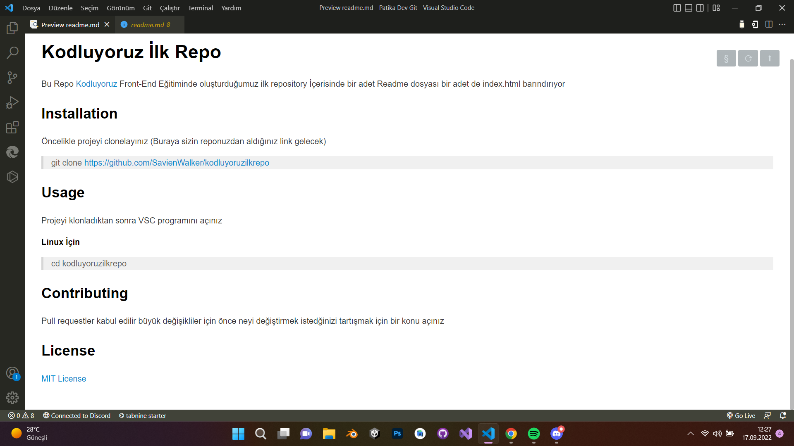

# Kodluyoruz İlk Repo

Bu Repo [Kodluyoruz](https://app.patika.dev) Front-End Eğitiminde oluşturduğumuz ilk repository İçerisinde bir adet Readme dosyası bir adet de index.html barındırıyor

## Installation

Öncelikle projeyi clonelayınız (Buraya sizin reponuzdan aldığınız link gelecek)

>git clone https://github.com/SavienWalker/kodluyoruzilkrepo

## Usage 

Projeyi klonladıktan sonra VSC programını açınız

**Linux İçin**

> cd kodluyoruzilkrepo

 ## Contributing 

 Pull requestler kabul edilir büyük değişikliler için önce neyi değiştirmek istedğinizi tartışmak için bir konu açınız

 ## License

 [MIT License](https://github.com/)

 